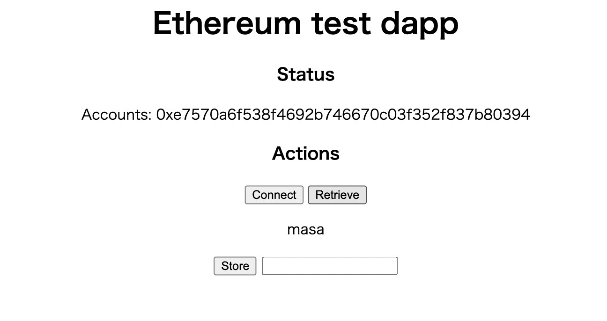

# webサイトとMet Maskを繋げる


# webフロントエンド
- metamask
<!-- ウォレットアプリ。秘密鍵の管理、コントラクトへの署名を行う。 -->
- ethers.js
<!-- イーサリアムのノードにアクセスするAPI。 -->
- browserify
<!-- Node.jsをブラウザでアクセスできるようにするためのモジュールバンドラー。 -->
# webバックエンド
- Node.js
<!-- スマートコントラクト開発環境 -->
- Remix
<!-- Solidity(スマートコントラクトの記述言語)をコンパイル＆デプロイするための開発環境。ブラウザベースなのでインストール不要。メタマスクとも接続できるため、コントラクトを直接デプロイすることができる。 -->

> vscodeプロジェクトディレクトリでコマンドを実行  
> このディレクトリ以下をnode.jsの配下にするぜ！  


# VsCodeのディレクトリ構成
```tsx
main.js
server.js
public/
 ├ index.html
 └ contract.js
```
---
# Remixを使ってスマートコントラクトのコンパイル＆デプロイ
> Remix:https://remix.ethereum.org/
> Remixにmessage.solファイルを作成する
```sol
pragma solidity >=0.7.0 <0.8.0;

contract Message {

    string message;

    function store(string memory msg_in) public {
        message = msg_in;
    }

    function retrieve() public view returns (string memory){
        return message;
    }
}
```
# SOLIDITY COMPILERのページ設定
- 左のメニューでCOMPILERを使用バージョンと合わせる
- Compile message.solを押すとコンパイルできる

# DEPLOY & RUN TRANSACTIONSのページ設定
- 左のメニューでENVIRONMENT選択項目でInjected Web3を選択すると接続しているネットワークにデプロイできる
- Deployボタンを押すとnetwork上にcontractをデプロイできる

# デプロイまでできたら次へ
---

# ブラウザ画面を作る
- index.htmlファイルを編集
```js
<html>
<head>
  <meta charset="UTF-8">
  <title>Ethereum test dapp</title>
</head>

<body>
      <h1>Ethereum test dapp</h1>
      <h3>Status</h3>
          <p>Accounts: <span id="accounts"></span></p>
              <h3 class>Actions</h4>
              <!-- コンタクトボタン(metamaskと接続させる) -->
              <button id="connectButton" disabled>Connect</button>
              <!-- ブロックチェーン上に載せたデータを取得するボタン -->
              <button id="retrieveButton" disabled>Retrieve</button>

              <p id="messageStatus">no status</p>
              <!-- データを送るボタン -->
              <button id="storeButton" disabled>Store</button>

              <input type="text" id="inputMessage">
  <script src="contract_browser.js" defer></script>
</body>

</html>
```

- contract.jsファイルを編集する
```js
// Node.js
// ethers.jsをインポートする
// ここにはobjectが入る
// 何に使うかわからんものばかりが入ってる（関数が入ってるようにも見える）
const { ethers } = require("ethers");
// 一つの関数にしたほうがいいってことか？
const initialize = () => {
    let accounts;
    const onboardButton = document.getElementById('connectButton');
    const retrieveButton = document.getElementById('retrieveButton');
    const storeButton = document.getElementById('storeButton');
    const messageStatus = document.getElementById('messageStatus');
    const inputMessage = document.getElementById('inputMessage');
    const accountsDiv = document.getElementById('accounts');
    let myContract;
    //Remixで取得できるABIをコピぺ
    const ContractAbi = ["オブジェクト"];
    // Remixからデプロイしたコントラクトのアドレスをコピペ
    const ContractAddress = "0x***"; //enter deployed contract address

    const isMetaMaskConnected = () => accounts && accounts.length > 0
    
    メタマスクがインストールされているかチェック
    const isMetaMaskInstalled = () => {
      // (ethereumにはobjectが入る)
      // 取得できる情報一覧
      // platform: "MacIntel"
      // selectedAddress: "0xe7570a6f538f469自分のウォレットアドレス"
      // isMetaMask: true
        const { ethereum } = window;
        // windowが取得できたらMetaMaskがtrueかfalseか
        return Boolean(ethereum && ethereum.isMetaMask);
    };

    const onClickConnect = async () => {
        try {
            const newAccounts = await ethereum.request({
              //戻り値  string[] -単一の16進数のイーサリアムアドレス文字列の配列
                method: 'eth_requestAccounts',
            })
            accounts = newAccounts;
            accountsDiv.innerHTML = accounts;
            if (isMetaMaskConnected()) {
                retrieveButton.disabled = false;
                retrieveButton.onclick = onClickRetrieve;
                storeButton.disabled = false;
                storeButton.onclick = onClickStore;

                // Web3Providerは、標準のWeb3プロバイダーをラップします。
                // Metamaskがwindow.ethereumとして各ページに挿入するもの
                const provider = new ethers.providers.Web3Provider(window.ethereum);//必須

                // Metamaskプラグインでは、トランザクションに署名することもできます
                //エーテルを送信し、ブロックチェーン内の状態を変更するために支払います。
                //このためには、アカウント署名者が必要です...
                const signer = provider.getSigner(0);//必須
                // Remixでデプロイしたコントラクトの情報が取れる
                myContract = new ethers.Contract(ContractAddress, ContractAbi, signer);
            }
        } catch (error) {
            console.error(error);
        }
    };

    const onClickRetrieve = async () => {
        try {
          // ブロックチェーン上のretrieve関数を実行
            let res = await myContract.retrieve();
            messageStatus.innerHTML = res;
        } catch (error) {
            console.error(error);
        }
    }
    const onClickStore = async () => {
        try {
          // inputタグから値を取得
            let message = inputMessage.value;
            // ブロックチェーン上のstore関数にmessegeを入れて実行
            myContract.store(message);
            messageStatus.innerHTML = 'Your message has been sent';
        } catch (error) {
            console.error(error);
        }
    }

    const MetaMaskClientCheck = () => {
      // isMetaMaskInstalledがfalseの場合
        if (!isMetaMaskInstalled()) {
            onboardButton.innerText = 'Please install MetaMask';
        } else {
      // isMetaMaskInstalledがfalseの場合
            onboardButton.innerText = 'Connect';
            onboardButton.onclick = onClickConnect;
            onboardButton.disabled = false;
        }
    };
    MetaMaskClientCheck();
};
window.addEventListener('DOMContentLoaded', initialize)
```

# node.jsサーバーの構築
- node.jsでサーバーに繋ぐためにはmain.jsとserver.jsの編集が必要です。
- 書き方はよくわかっていないので調べてから追記します。
main.jsとserver.jsを参照してください


---
# browserifyでビルド
- browserifyでバンドルし、ブラウザで利用できるようにします。
```bash
npx browserify ./public/contract.js -o ./public/contract_browser.js
```

# Node.jsでアプリを起動
```bash
node ./main.js
```